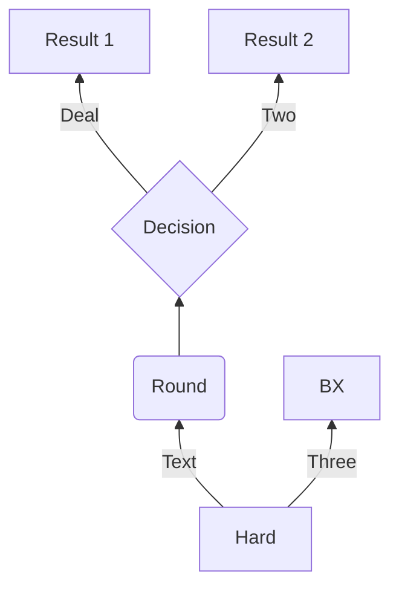
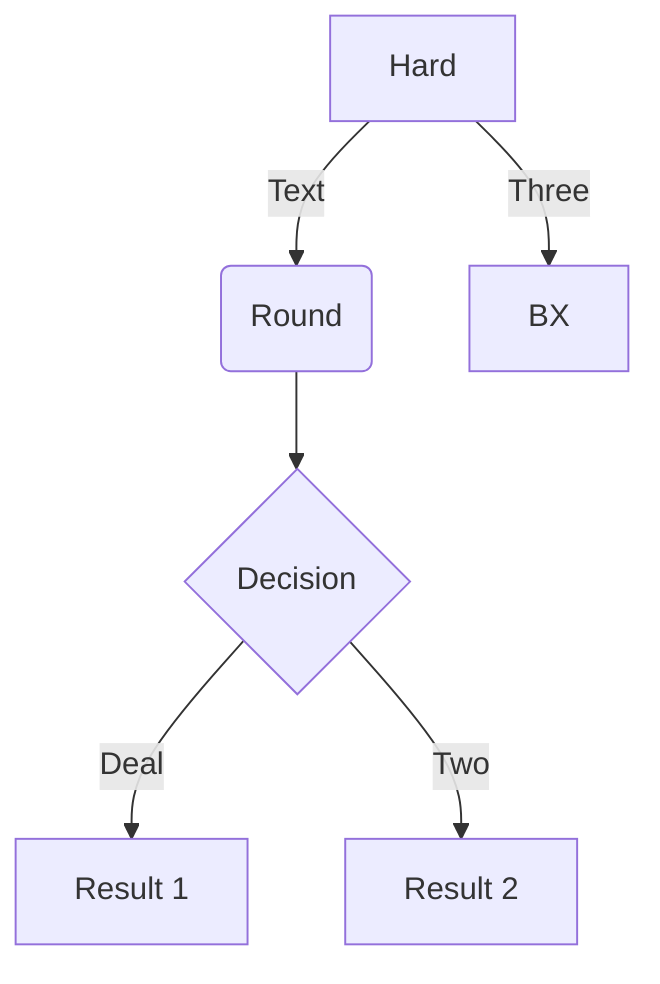

# Hello mermaid

```mermaid
flowchart BT

A[Hard] -->|Text| B(Round)
B --> C{Decision}
C -->|Deal| F[Result 1]
C -->|Two| E[Result 2]
A -->|Three| BX

```

SSomething else

```mermaid

graph TD
    A[Hard] -->|Text| B(Round)
    B --> C{Decision}
    C -->|Deal| F[Result 1]
    C -->|Two| E[Result 2]
    A -->|Three| BX
```