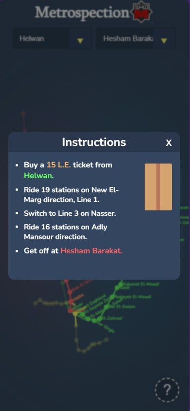

Metrospection is a Progressive Web Application (PWA) designed to assist non-Cairo residents in navigating the Egyptian metro system with ease. Leveraging modern web technologies, including React, responsive design, and the Geolocation API, Metrospection offers an intuitive interface for users to explore metro routes, find nearby stations, and plan their journeys efficiently.

Key Features
- Responsive Design: Metrospection is built with responsiveness in mind, ensuring a seamless user experience across various devices, including desktops, tablets, and smartphones.

- Geolocation API: By utilizing the Geolocation API, Metrospection provides users with accurate information about their current location relative to metro stations, facilitating quick route planning and navigation.

- SVG Graphics: The use of Scalable Vector Graphics (SVG) allows for high-quality, scalable maps and visual representations of metro routes, ensuring clarity and ease of understanding for users.

## Gallery 

