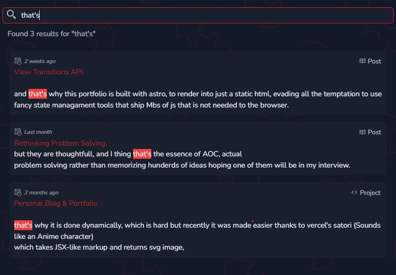

## Astro
Astro has the most trivial way to implement a blog thx to [Content Collections](https://docs.astro.build/en/guides/content-collections/), the start project is literally a blog and there other starting blog templates like [AstroPaper](https://astro.build/themes/details/astro-paper/) (this blog was based on it) , however this project has some intersting non-trivial implementations.

## opt-in to SSR
This project was inilially intended to be `statically generated` and deployed to github pages, why not you might ask ?
I thought of it as a challenge to go back to the classics doing as much as possible with just plain old js, maybe with sprinkles of typescript, but the logic holds.

However, When implementing this contact me form, it will use an API service to deliver the message to me, and this service will require an API key, and to make everything clientside ... this API key would be sent to the user, which is not obviously not safe, It can be redacted but cannot completly removed. 


So, generally when using sensitive data it should be server-side. 

```typescript
import { defineConfig } from "astro/config";

export default defineConfig({
  // options
  output: "hybrid", // default "static" also takes "server" 
});
```

output `hybrid` basically means you're using SSG (static site generation) mode, unless you say otherwise.
you can use this snippet in your desired path to make it serverside rendered.

```typescript
// in `pages/path.astro`
export const prerender = false;
```

## SEO
Astro went big on SEO, 

It's a common practice in Astro to make a template that takes  
```astro
    ---
    export interface Props {
      title: string;
      description?: string;
      ogImage?: string;
    }

    let {
      title = "Fallback title",
      description = "Fallback desc",
      ogImage = "/assets/fallback.jpg",
    } = Astro.props;

    const author = "Nasser"
    const canonicalURL = new URL(Astro.url.pathname, Astro.site).href; 

    ---
    <!-- Other content -->
    <head>
      <meta charset="UTF-8" />
      <meta name="viewport" content="width=device-width" />
      <link rel="icon" type="image/svg+xml" href="/favicon.svg" />
      <link rel="canonical" href={canonicalURL} />
      <meta name="generator" content={Astro.generator} />
      <title>{title}</title>
      <meta name="title" content={title} />
      <meta name="description" content={description} />
      <meta name="author" content={SITE.author} />
      <link rel="sitemap" href={SITE.website+"/rss.xml"} />
    </head>
    <body>
        <header><!-- header --></header>
        <aside><!-- side bar --></aside>
        <slot>
        <footer><!-- footer --></footer>
    </body>
```
It's a common practice in astro to use a Layout component to add all the meta tags and overwrite it when desired and never worry about them.

### Dynamic OG images
when you're posting some post to facebook (YOU'RE A BOOMER) you might find the post look something like this.

  
To implement this behaviour you add meta tags like this one. 
```html
<meta property="og:image" content="<url>" />
```
but wait a minute, this way makes all posts has the same image, or you create an Image for every post by hand, which is impossible,
that's why it is done dynamically, which is hard but recently it was made easier thanks to vercel's `satori` (Sounds like an Anime character)
which takes JSX-like markup and returns svg image, and then you might use something like `resvg`to convert the svg bufer to a png.
Now how to make it into a dynamic image on the web ?
on your framework of choice you can add an API Endpoint, 
make it return
```typescript
export const GET: APIRoute = async ({ props }) =>
  new Response(await generateOGImage(props), {
    headers: { "Content-Type": "image/png" },
});
```
and you might make all the images generated on build time in astro by supplying `getStaticPaths` function.
```typescript
export async function getStaticPaths() {
  const posts = await getCollection("blog");
  return posts.map(post => ({
    params: { slug: post.slug },
    props: post,
  }));
}
```

so that if the post is at `https://your-domain.com/blog/portfolio`, the OG Image is at `https://your-domain.com/blog/portfolio.png` or any other setup you like.
Then add it dynamically to the layout
```astro
<meta property="og:image" content={`https://your-domain.com/blog/${postSlug}.png`} />
```

## Image optimization
One of the most important aspects of a website is performance
what to render, when to render it, and how to do so, all to ensure the best performance.
You can approach that by optimizing images to make the website load fast and provide better user experience.

Astro provides modulues to 
- Compress Images to multiple versions that are used according to the users need.
- Which will decrease bundle size.
- Decrease load time.
- Done at either build or runtime.
- Use `webp` or `avif` that are modern lighter alternative formats.

## View transitions 
You might have seen view transitions api used, if not check it out in examples like [this one](https://live-transitions.pages.dev/) for multitude of things, but I'll show you how I used it to animate navbar state based on current route.

```astro
          <ul id="menu" class="nav-items-container ">
            {
              PATHS.map(({name, path, icon}) => {
                const isActive = currentPagePath.includes(trim(path, "/"))
                return (
                  <li class="nav-item-wrapper">
                    this 
                    <a href={path}  class={"nav-item" + (isActive?" non-animating-styles":"")}>
                      <span class="place-self-center  w-full">{name}</span>
                    </a>
                    {/* Moving Rectangle */ 
                     isActive ? (<span transition:name="active-nav" class="absolute top-0 left-0 h-full hidden sm:block w-full  border-skin-accent bg-black/10 border-2 rounded-xl"></span>) : null }
                    </li>)
              })
          }
```
and used the same way to implement tabs, and here is the output.


## Search
### Search by tag
This is server-side, gets the query params and renders the posts assiociated with the desired tags.

```typescript
import { slugifyAll } from "./slugify";
import type { CollectionEntry } from "astro:content";

type ItemsType = CollectionEntry<"blog"> | CollectionEntry<"projects">
const getItemsByTags = (Items: ItemsType[], tags: string[]) => {
  const checkTags = (item: Item) =>
    tags?.some(tag => slugifyAll(item.data.tags).includes(tag));
  return Items.filter(checkTags);
};

export default getItemsByTags;
```

and then render use it to render tags.

### Search by text
This one is client-side, And you might think I'd use [fuse.js](https://www.fusejs.io/) which a great library to introduce fuzzy search to your project. 
> Fuzzy Search: it is antynom of `exact search`, search by proximity using multiple matching algorithms.

But I wanted to implement something fast and custom and I'll probably move it to the sever and use fuzzy search once the number of items increase, but it's fine for now.

```typescript 
const allitems = await getCollection("blog");
const allProjects = await getCollection("projects");
const allItems = [...allitems, ...allProjects];
const Items = getItemsByTags(allItems, tags);
```
and render them and them all and then hide them in the client-side, which is -again- a bad idea but it's fine for small number of items to be loaded all at once.

```typescript
  import { slugifyStr } from "@utils/slugify";
  import { getCollection, type  CollectionEntry } from "astro:content";
  import removeMd from "remove-markdown"; 
  const posts = await getCollection("blog");
  const projects = await getCollection("projects"); 
  type Entry = CollectionEntry<"blog"> | CollectionEntry<"projects"> 
  type searchResult =  {
        match: [string, string, string]
        title: string
  }

  const WINDOW_SIZE = 800; 
  const SENTENCES = 2; 

  const entries = [...posts, ...projects] as Entry[] 
  const entryCount = entries.length 
  function sentence(s: string, first: boolean) {
      const delimiters = /[.!?,;\n]/g; 
      const delimiterPositions = [...s.matchAll(delimiters)].map(match => match.index);
      if (first) {
          const firstDelimiterPosition = delimiterPositions.at(SENTENCES);
          return firstDelimiterPosition !== undefined ? s.slice(0, firstDelimiterPosition + 1) : s;
      } else {
          const lastDelimiterPosition = delimiterPositions.at(-SENTENCES);
          return lastDelimiterPosition !== undefined ? s.slice(lastDelimiterPosition + 1) : s;
      }
    }

  function getMatch(entry: Entry, query: string) {
        const blob = [entry.data.title, entry.data.description, removeMd(entry.body)].join("\n")
        const start = blob.toLowerCase().indexOf(query.toLowerCase())
        const end = start + query.length
        if (start !== -1) {

          const pre = sentence(blob.slice(start - WINDOW_SIZE, start), false)
          const match = blob.slice(start, end)
          const post = sentence(blob.slice(end, end + WINDOW_SIZE), true)

            return{
                match: [pre, match, post],
                title: slugifyStr(entry.data.title)
            }        
        }

    }


```
> this might be a huge blob of code but it's not doing any magic, jsut hiding items and handling different cases.



## BATMAN
as you might have seen this site is sarcastically? heavily-batman-themed, which a great way to learn about svg pattern, `filter`s, optimization, `path`, `defs`, ...etc
 
## Glossary
This was a great project to learn about build tools capabilities, browser APIs, type-safety, project structuring.
