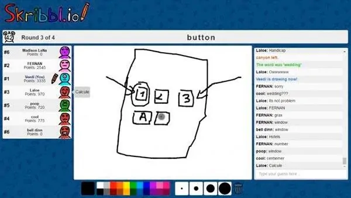

## Introduction


The Scribble Game is a fun and creative activity where players take turns drawing images based on given prompts or phrases. It's a fantastic way to unleash your imagination, challenge your artistic skills, and have a blast with friends or family.

### How to Play

1. **Setup:** Gather a group of players and designate one person as the "drawer" for each round.

2. **Prompt:** Choose a prompt or phrase for the current round. This could be anything from simple objects like "cat" or "house" to more complex ideas like "outer space adventure" or "underwater kingdom".

3. **Drawing:** The drawer has a limited amount of time (usually a minute or two) to sketch their interpretation of the prompt. They can use any drawing tools available, whether it's pen and paper, a digital drawing app, or a whiteboard.

4. **Guessing:** While the drawer is sketching, the other players try to guess what the drawing represents. They can shout out their guesses or write them down privately.

5. **Winner:** The player who correctly guesses the prompt earns a point. Alternatively, you can award points to the drawer if someone guesses correctly within a certain time limit.

6. **Rotation:** Rotate the role of the drawer to the next player, and repeat the process with a new prompt.

7. **End Game:** The game can continue for as many rounds as desired, with players accumulating points. The player with the most points at the end is declared the winner!


the game was so much fun for me and my friends so I wanted to recreate it, how you might ask?
> One of the fun parts that it has no login, no signup, just play, this is important later


## Attempt #1 Database
I was tempted to use SSR to make it secure, or so I thought, so I scafolded a [t3 app](https://create.t3.gg/), (nextjs, prisma, tailwind, trpc, nextauth), quickly modeled a database schema, and started creating tRPC endpoints like a caveman. and i actually got it working, both the canvas and the guesses were synced,
and they insert in the db and websockets subscriptions are created to revalidate whever something happens, seems great at first but those to many refetches were heavy and expensive.
I even created abstractions over the subscriptions and mutations to prevent code redundency, there will be a blog post about these so stay tuned.

### Improvemnet 
the games are disposable, and theres no point of keeping track of all of these transactions if they are gonna get deleted after the game ends, I could use the database to store the games and the players in them, and the context of the game could be in-memory, okay great, now let's implement it!
- how to keep track of the connected player on this game room `https://<game-domain>/<roomId>`, maybe a use the webosockets connection and use the `clientId` as the playerId ?
- how to make all the game logic? It was so hard to implement all the state and logic in ovbservers and subsriptions
  - return to lobby of there are not enough players `onPlayerLeave`  
  - if everyone guessed the word correctly, end the round
  - etc.. 

## **Attempt #2** [xState](https://stately.ai/docs/xstate) 

> xState is a JavaScript library for creating finite state machines and statecharts. It simplifies managing application state and transitions, improving code clarity and predictability. xState features hierarchical states, transition guards, and actions for side effects. Visualization tools aid debugging and comprehension of statecharts.

This was my introduction to xState, it sold me very much on the idea of `smart and dumb components` so I created the state chart that is visualized and running effictively with no possible bad states

> here is a picture of the state machine that I've built

### Caveat 
Of course it wasn't perfect for my problem, now I have a machine that runs on the client, if I want it multiplayer I should replicate the machine and synchronize all the copies through a websockets connection, and this is a HUGE problem, if one user had a bit of lag or delay or disconnected for couple of milliseconds, the players that are playing the same game would have different state, maybe differnet leaderboard.

I didn't find anything on running a state machine on the server and sending back everything using ws events.
all i found using services like stately sky (by the creators of xState) or partykit.

## **Attempt #3** [YJS](https://docs.yjs.dev/)
> Yjs is a JavaScript library for building collaborative applications with Conflict-free Replicated Data Types (CRDTs). It simplifies creating real-time collaborative experiences by managing distributed state seamlessly.

Yjs supports various providers for communication and synchronization, including `WebRTCProvider`, `WebSocketProvider`, `IndexedDBProvider`, and more. These providers facilitate communication between clients and handle synchronization of changes, ensuring a smooth collaborative experience across devices and platforms.

I used a YJS wrapper called [syncedStore](https://syncedstore.org/docs/), which is an amazing project.


- each game can be it's own `YJSDoc` and I can manage the whole state in a `deepObserver` and send events like I used to do with xState, I actually replicated some of the design choices they made about sending events

I divided the game into 
1. **Game State:** the single source of truth, every player always have the same state, even if disconnected, will resync after reconnecting.
```ts
export const initialState: State = {
    value: "lobby",
    canvas: {
        paths: [[ [] , defaultOpts]],
        points: [],
        opts: defaultOpts,
    },
    context: {
        config: {
            maxPlayers: 8,
            hints: 2,
            roundTime: 100,
            rounds: 5,
            difficulty: "medium",
            locale: "en",
        },
        gameId: "",
        players: {},
        guesses: [],
        wordOptions: [],
        roundsLeft: 0,
        remainingTime: 0,
        currentWord: "",
        currentDrawer: "",
        owner: "",
        word_choosing_time: delays.word_choosing / 1000
    }
};
```

2. **Checks/Guards:** 
```ts
const guards = (state: typeof store.state) => ({
    "round_running": () => state.value === "game.running" && state.context.remainingTime > 0,
    "all_guessed": () => Object.entries(state.context.players).filter(([id, _])=>id !== state.context.currentDrawer).every(([_, p])=>p.guessed),
    "time_up": () => state.context.remainingTime <= 0,
    "has_players": () => Object.keys(state.context.players).length > 0,
    "enough_players": () => Object.keys(state.context.players).length > 1,
    "room_not_full": () => Object.keys(state.context.players).length >= state.context.config.maxPlayers,
    "has_owner" : () => state.context.owner !== "",
    // etc
}) as const; 
```

3. **Actions/Events:**
```ts
const actions: Events =  {
    choose_word: ({ payload }) => {
        store.state.value = "game.running"
        store.state.context.currentWord = payload.word;
        send({type: "start_round"})
    },
    pick_random_word:  () => {
        send( { type: "choose_word", word: oneOf(store.state.context.wordOptions) } )
    },
    join: ({ payload })=>{
        connect(payload.roomId);
        player.atom.set({...player.atom.get(), id: payload.id});
        if (store.state.context.owner === "") {
            store.state.context.owner = payload.id;
        }
        store.state.context.players[payload.id] = { name: payload.name, avatar: payload.avatar, score: 0, guessed: false };
    },
    leave: ({ payload }) => {
        const id = player.atom.get().id;
        const isOwner = store.state.context.owner === id;
        if (isOwner) {
            const owner = Object.keys(store.state.context.players).find((id)=>id!== store.state.context.owner) as string;
            store.state.context.owner = owner;
        }
        Object.hasOwn(store.state.context.players, id) ? delete store.state.context.players[id] : null;
    },
    rate_drawing: ({  payload }) => {
        (store.state.context.players[payload.player_id] as Player).drawingRating = payload.rating;
    },
    guess: ({ payload }) => {
        const player = store.state.context.players[payload.id];
        if (!player) return;
        const newGuess = {word: payload.word, id: payload.id};
        store.state.context?.guesses.push(newGuess);
        const correct = store.state.context.currentWord === payload.word;
        if (!player.guessed && correct && store.state.context.players[payload.id]) {
            player.guessed = true;
            player.timeStamp = store.state.context.remainingTime;
        }
    },

    // etc
}
```

4. **Policies/Rules:** 
```ts
const rules: Record<string, () => boolean> = {
    "ENSURE_PLAYERS_COUNT": () => {
        if (!is("lobby") && !is("enough_players")) {
            store.state.value = "lobby";
            return true
        }
        return false
    },
    "ENSURE_OWNER": () => {
        if (!is("has_owner") && is("has_players")) {
            store.state.context.owner = Object.keys(store.state.context.players)[0] as string;
            return true
        }
        return false 
    },
    "ENSURE_ROUND_END": () => {
        if ( is("game_running")  && (is("all_guessed") || is("time_up"))) {
            console.log(store.state.value, store.state.context.remainingTime )
            send({ type: "end_round" });
            return true
        }
        return false
    },
    "ENSURE_WORD_CHOSEN": () => {
        if (is("word_choosing") && !is("word_choosing_ruuning")){
            send({ type: "pick_random_word" });
            return true
        }
        return false
    },
}

observeDeep(store, ()=>{
    Object.entries(rules).forEach(([ruleName, rule]) => {
        const success = rule();
        if (success) {
            console.log(" Game rule succeeded ", ruleName)
        }
    });
})

```

now all the state matches, and state easily managable and extendible.

## Gallery 


